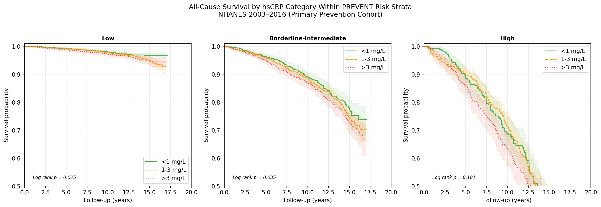
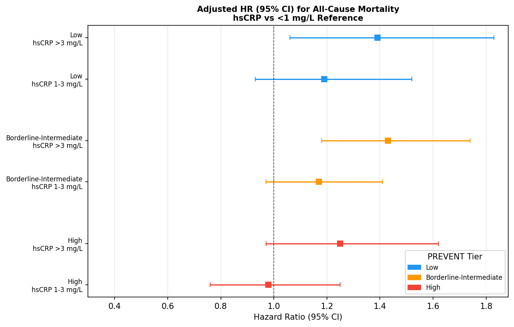

# The Additive Prognostic Value of C-Reactive Protein for All-Cause and Cardiovascular Mortality Across the PREVENT-Defined Cardiovascular Risk Continuum: A Nationally Representative Cohort Study

Andrew Bouras, B.S.^1^, Vikash Jaiswal, M.D.^2^

^1^Nova Southeastern University Dr. Kiran C. Patel College of Osteopathic Medicine, Clearwater, FL, USA

^2^Department of Medicine, Brown University, Providence, RI, USA

Corresponding Author: Andrew Bouras, B.S., Nova Southeastern University Dr. Kiran C. Patel College of Osteopathic Medicine, Clearwater, FL 33760, USA. Email: ab4646@mynsu.nova.edu

## Abstract

Aims: High-sensitivity C-reactive protein (hsCRP) is recognized as a cardiovascular risk-enhancing factor, yet whether its prognostic value varies across the spectrum of baseline cardiovascular risk defined by the American Heart Association (AHA) PREVENT equations remains unknown. We evaluated the additive prognostic value of hsCRP for all-cause and cardiovascular mortality across PREVENT-stratified risk groups in a nationally representative US cohort.

Methods and Results: We analyzed 14,124 adults aged 30 to 79 years without baseline atherosclerotic cardiovascular disease (ASCVD) from the National Health and Nutrition Examination Survey (NHANES) 2003 to 2016, with mortality follow-up through December 31, 2019 (mean follow-up 10.2 years). Participants were stratified by PREVENT 10-year cardiovascular disease risk (low, borderline-intermediate, high) and hsCRP category (less than 1, 1 to 3, greater than 3 mg/L). All-cause mortality was assessed using multivariable Cox proportional hazards models, and cardiovascular mortality was assessed using cause-specific Cox models. During follow-up, 1,364 all-cause deaths (9.7%) and 335 cardiovascular deaths (2.4%) occurred. For all-cause mortality, hsCRP greater than 3 mg/L was independently associated with increased risk in the borderline-intermediate risk group (hazard ratio [HR] 1.43, 95% confidence interval [CI] 1.18 to 1.74, P = 0.0003) and the low risk group (HR 1.39, 95% CI 1.06 to 1.83, P = 0.018), but not in the high risk group (HR 1.25, 95% CI 0.97 to 1.62, P = 0.085). For cardiovascular mortality, hsCRP greater than 3 mg/L was significantly associated only in the borderline-intermediate risk group (HR 1.46, 95% CI 1.05 to 2.01, P = 0.023). A formal test of the CRP × PREVENT-tier interaction was significant for cardiovascular mortality (likelihood-ratio χ²[4 df] = 16.34, P = 0.003) but not for all-cause mortality (χ²[4 df] = 4.22, P = 0.38). Adding hsCRP to the base covariate model improved discrimination in the borderline-intermediate group (change in C-statistic 0.0062, 95% CI 0.0012 to 0.0134), with a directionally similar but nonsignificant improvement in the high risk group (change in C-statistic 0.0099, 95% CI −0.0017 to 0.0266) and no improvement in the low risk group (change in C-statistic −0.0081, 95% CI −0.0159 to 0.0045).

Conclusion: Elevated hsCRP confers additive prognostic value for cardiovascular mortality primarily among adults at borderline-intermediate PREVENT-defined cardiovascular risk, the population segment where clinical decision-making regarding preventive therapy is most uncertain. These findings support the targeted use of hsCRP as a risk-enhancing factor in this population.

Keywords: C-reactive protein, cardiovascular risk, mortality, PREVENT equations, NHANES, risk stratification

## Introduction

C-reactive protein (CRP) is a well-established biomarker of systemic inflammation that has been extensively studied as a predictor of cardiovascular events and mortality. An individual participant meta-analysis of 160,309 adults without prior vascular disease demonstrated that CRP concentration is continuously associated with ischemic heart disease, stroke, vascular mortality, and nonvascular mortality, with log-linear risk ratios of approximately 1.37 per standard deviation increase after adjustment for conventional risk factors [1]. The 2019 American College of Cardiology/American Heart Association (ACC/AHA) guideline on the primary prevention of cardiovascular disease identifies high-sensitivity CRP (hsCRP) greater than or equal to 2 mg/L as a risk-enhancing factor that may inform shared decision-making regarding statin initiation, particularly in patients at borderline or intermediate risk [2]. The clinical utility of this recommendation, however, rests on the assumption that hsCRP provides meaningful prognostic information beyond traditional risk factors, and that this information is differentially valuable across the risk spectrum.

The AHA recently introduced the Predicting Risk of cardiovascular disease EVENTs (PREVENT) equations, a new risk prediction model that incorporates kidney function (estimated glomerular filtration rate) alongside traditional cardiovascular risk factors [3]. The PREVENT equations represent a substantial methodological advance over the Pooled Cohort Equations by incorporating cardiovascular-kidney-metabolic health and using contemporary, diverse cohorts for model derivation [3]. Whether hsCRP retains its prognostic value when patients are stratified by this updated risk assessment framework has not been evaluated.

Prior studies examining CRP and mortality across the cardiovascular risk continuum have generally relied on older risk assessment tools. Al-Jarshawi and colleagues recently evaluated lipoprotein(a) across the risk continuum using NHANES data stratified by PREVENT-defined risk groups, establishing a methodological precedent for this approach [4]. No comparable analysis exists for CRP, despite its broader clinical availability and established role in guideline-directed risk assessment [5,6]. A recent large-scale analysis of 448,653 UK Biobank participants reported that CRP greater than 3 mg/L was associated with 54% higher all-cause mortality and 61% higher cardiovascular mortality compared with CRP less than 1 mg/L, with a net reclassification improvement of 14.1% for major adverse cardiovascular events when CRP was added to the SCORE2 model [7]. However, that study did not employ the AHA PREVENT framework for risk stratification.

Notably, the 2025 European Society of Cardiology/European Atherosclerosis Society (ESC/EAS) focused update on the management of dyslipidaemias has endorsed a binary hsCRP threshold of 2 mg/L for cardiovascular risk stratification [8], aligning with the AHA risk-enhancer cutoff. Whether this threshold retains prognostic value when applied across the spectrum of PREVENT-defined risk has not been examined.

This study addresses this gap by evaluating the additive prognostic value of hsCRP for all-cause and cardiovascular mortality across PREVENT-stratified risk groups in a nationally representative US cohort, using the clinically established AHA/CDC hsCRP cutoffs [5], the AHA guideline risk-enhancer threshold [2], and a prespecified subanalysis applying the ESC/EAS 2025 binary threshold of less than 2 versus 2 mg/L or greater [8].

## Methods

### Study Population

We used data from NHANES continuous survey cycles spanning 2003 to 2016 (cycles 2003-2004, 2005-2006, 2007-2008, 2009-2010, and 2015-2016). NHANES employs a complex, multistage probability sampling design to provide nationally representative estimates of the civilian, noninstitutionalized US population [9]. We included adults aged 30 to 79 years who underwent a physical examination (MEC component) and had available hsCRP measurements. We excluded participants with self-reported prevalent ASCVD (prior myocardial infarction, coronary heart disease, congestive heart failure, angina pectoris, or stroke, ascertained from the Medical Conditions Questionnaire variables MCQ160B through MCQ160F). We further excluded participants missing data for any PREVENT equation input variable (body mass index, systolic blood pressure, total cholesterol, high-density lipoprotein cholesterol [HDL-C], or serum creatinine) or survey examination weights. Participants with hsCRP greater than 10 mg/L were excluded from the primary analysis to minimize confounding by acute inflammation, consistent with the AHA/CDC recommendation [5]. NHANES cycles 2011 to 2012 and 2013 to 2014 were excluded because hsCRP was not measured in those cycles.

### Exposure Assessment

Serum hsCRP was measured using latex-enhanced nephelometry at the NHANES laboratory. For cycles 2003 to 2010, CRP was reported in mg/dL and converted to mg/L by multiplying by 10. For cycle 2015 to 2016, CRP was reported directly in mg/L. We categorized hsCRP using the AHA/CDC clinical cutoffs: low risk (less than 1 mg/L), average risk (1 to 3 mg/L), and high risk (greater than 3 mg/L) [5]. A secondary dichotomization at 2 mg/L was used to evaluate both the AHA guideline risk-enhancer threshold [2,10] and the ESC/EAS 2025 binary classification of less than 2 versus 2 mg/L or greater [8].

### Cardiovascular Risk Stratification

We calculated 10-year total cardiovascular disease risk using the AHA PREVENT base model (without urinary albumin-to-creatinine ratio or hemoglobin A1c) [3]. The PREVENT equation inputs included age, sex, total cholesterol, HDL-C, systolic blood pressure, antihypertensive treatment status, diabetes, current smoking status, body mass index, and estimated glomerular filtration rate (eGFR, calculated using the CKD-EPI 2021 race-free creatinine equation [11]). Our Python implementation of the PREVENT base equations was validated against the preventr R package (version 0.11.0) [12], which reproduces the published PREVENT coefficients, using three reference patients spanning the risk continuum (40-year-old female with optimal labs and no risk factors; 60-year-old male with treated hypertension and mild chronic kidney disease; 70-year-old male with diabetes, current smoking, and chronic kidney disease). All three reference patients matched preventr v0.11.0 to three decimal places, and the validation is implemented as an automated regression test that runs at the start of every analysis execution. Participants were categorized into PREVENT risk tiers: low (less than 5%), borderline (5% to less than 7.5%), intermediate (7.5% to less than 20%), and high (20% or greater). Borderline and intermediate groups were combined into a single borderline-intermediate category to ensure adequate event counts for stratified analyses, consistent with the approach used in prior NHANES-based PREVENT risk stratification studies [4].

### Outcome Ascertainment

The primary outcomes were all-cause mortality and cardiovascular mortality, ascertained through linkage with the National Death Index through December 31, 2019 [13]. All-cause mortality was defined as death from any cause (MORTSTAT = 1). Cardiovascular mortality was defined using the NHANES public-use nine-category underlying cause of death recode, which identifies heart disease (category 001) and cerebrovascular disease (category 005). Follow-up time was calculated from the NHANES examination date to the date of death or the end of the mortality follow-up period, whichever occurred first.

### Covariates

Covariates included age (continuous), sex, total cholesterol, HDL-C, systolic blood pressure (mean of the second through fourth readings, per CDC protocol, excluding the first practice reading), body mass index, eGFR, diabetes status (self-reported physician diagnosis, insulin use, or oral diabetes medication use), current smoking status (self-reported ever smoking plus current daily or intermittent use), and antihypertensive medication use.

### Statistical Analysis

Survey examination weights were divided by the number of pooled cycles (five cycles) per CDC recommendations for combining multiple continuous NHANES cycles [9]. Descriptive statistics were calculated as survey-weighted means with standard deviations for continuous variables and weighted percentages for categorical variables, stratified by PREVENT risk tier and hsCRP category.

Multivariable Cox proportional hazards regression models were used to estimate hazard ratios (HRs) and 95% confidence intervals for all-cause mortality associated with hsCRP category (reference: less than 1 mg/L), stratified by PREVENT risk tier. Three models were fit: unadjusted, adjusted for all covariates, and adjusted with survey weights applied using robust (sandwich) variance estimation. Cardiovascular mortality was analyzed using cause-specific Cox proportional hazards models, in which non-cardiovascular deaths were censored at the time of death [14]. This approach estimates the instantaneous hazard of cardiovascular death conditional on being alive, which is the standard approach when competing risks are present and the focus is on etiologic associations [14].

To formally test whether the association between hsCRP and mortality differed across PREVENT risk tiers, we fit a single Cox proportional hazards model on the full cohort containing main effects for the two CRP indicator categories, the two PREVENT-tier indicators, all adjustment covariates, and the four CRP × tier product terms. The joint null hypothesis that all four interaction coefficients equal zero was tested using a likelihood-ratio test (4 degrees of freedom) comparing the full model to a reduced model containing only main effects and covariates. A confirmatory Wald χ² statistic on the same four interaction coefficients was also computed. Because joint Wald inference under survey weights is sensitive to the variance-matrix scaling implementation, the formal interaction test was performed on unweighted Cox models, while the primary stratum-specific HRs continue to be reported from both unweighted and survey-weighted models.

Discrimination was evaluated using Harrell's C-statistic for survey-weighted Cox models with and without hsCRP indicators, computed within each PREVENT tier [15]. The change in C-statistic was estimated with 95% confidence intervals from 300 nonparametric bootstrap resamples (seed = 42), with each bootstrap fit using the same weighted Cox model and robust variance estimator as the primary analysis.

Sensitivity analyses included Cox models without the hsCRP greater than 10 mg/L exclusion. A prespecified subanalysis evaluated the dichotomized hsCRP threshold of 2 mg/L or greater, corresponding to both the AHA guideline risk-enhancer cutoff [2,10] and the ESC/EAS 2025 binary classification [8], to assess concordance between American and European guideline thresholds. Kaplan-Meier survival curves were generated for each PREVENT tier by hsCRP category.

All analyses were conducted using Python 3.11 with the lifelines package (version 0.30.1) for survival analysis and the preventr R package (version 0.11.0) as the PREVENT reference implementation. A two-sided P value less than 0.05 was considered statistically significant.

## Results

### Study Population

Of 51,127 participants across five NHANES cycles, 14,124 met all inclusion criteria after sequential exclusions (Supplemental Figure 1). The survey-weighted mean age was 49.5 years and 49.5% were male; the unweighted mean follow-up duration was 10.2 years (survey-weighted 10.5 years). A total of 1,364 all-cause deaths (9.7%) and 335 cardiovascular deaths (2.4%) occurred during follow-up.

PREVENT risk tier distribution was as follows: 8,341 (59.1%) were classified as low risk, 4,682 (33.1%) as borderline-intermediate risk, and 1,101 (7.8%) as high risk. The hsCRP distribution was: 4,386 (31.1%) with hsCRP less than 1 mg/L, 5,412 (38.3%) with hsCRP 1 to 3 mg/L, and 4,326 (30.6%) with hsCRP greater than 3 mg/L. Baseline characteristics stratified by PREVENT tier and hsCRP category are presented in Table 1.

Across all risk tiers, participants with higher hsCRP tended to have higher body mass index, higher systolic blood pressure, greater prevalence of diabetes, and higher rates of current smoking. Median hsCRP ranged from 0.50 mg/L in the low-CRP subgroups to 5.00 mg/L in the high-CRP borderline-intermediate subgroup. All-cause mortality rates increased across both PREVENT tiers and hsCRP categories, ranging from 2.3% in the low risk/low CRP subgroup to 41.4% in the high risk/high CRP subgroup.

### All-Cause Mortality

In adjusted Cox proportional hazards models (Table 2), elevated hsCRP was independently associated with increased all-cause mortality risk in the borderline-intermediate PREVENT tier. Compared with hsCRP less than 1 mg/L, hsCRP greater than 3 mg/L was associated with a 43% higher risk of all-cause mortality (HR 1.43, 95% CI 1.18 to 1.74, P = 0.0003), while hsCRP 1 to 3 mg/L showed a nonsignificant trend (HR 1.17, 95% CI 0.97 to 1.41, P = 0.100).

In the low PREVENT risk tier, hsCRP greater than 3 mg/L was also associated with significantly increased all-cause mortality (HR 1.39, 95% CI 1.06 to 1.83, P = 0.018), though the absolute event rate remained low (238 deaths among 8,341 participants over 10.2 years of follow-up).

In the high PREVENT risk tier, there was a nonsignificant trend toward increased mortality with elevated hsCRP (HR 1.25, 95% CI 0.97 to 1.62, P = 0.085 for hsCRP greater than 3 mg/L).

Survey-weighted models yielded consistent but somewhat stronger associations, with hsCRP greater than 3 mg/L associated with an HR of 2.38 (95% CI 1.42 to 3.98, P = 0.001) in the low risk tier and HR 1.52 (95% CI 1.14 to 2.02, P = 0.005) in the borderline-intermediate tier. The formal test of the CRP × PREVENT-tier interaction for all-cause mortality was not statistically significant (likelihood-ratio χ²[4 df] = 4.22, P = 0.38; confirmatory Wald χ²[4 df] = 4.20, P = 0.38), indicating that, on the multiplicative scale, the CRP–all-cause-mortality association did not differ significantly across PREVENT risk tiers despite the differing stratum-specific point estimates.

### Cardiovascular Mortality

In cause-specific Cox models for cardiovascular mortality (Table 3), elevated hsCRP was significantly associated with cardiovascular death only in the borderline-intermediate PREVENT tier. HsCRP greater than 3 mg/L was associated with a 46% higher risk of cardiovascular mortality (HR 1.46, 95% CI 1.05 to 2.01, P = 0.023), while hsCRP 1 to 3 mg/L showed no association (HR 1.01, 95% CI 0.73 to 1.39, P = 0.959).

In the low PREVENT risk tier, neither hsCRP category was associated with cardiovascular mortality (HR 0.98, 95% CI 0.67 to 1.42 for 1 to 3 mg/L; HR 1.01, 95% CI 0.67 to 1.51 for greater than 3 mg/L), likely reflecting the very low event rate (36 cardiovascular deaths among 8,341 participants). In the high risk tier, point estimates were elevated but did not reach statistical significance (HR 1.19, 95% CI 0.74 to 1.90, P = 0.476 for hsCRP greater than 3 mg/L).

In contrast to all-cause mortality, the formal test of the CRP × PREVENT-tier interaction was statistically significant for cardiovascular mortality (likelihood-ratio χ²[4 df] = 16.34, P = 0.003; confirmatory Wald χ²[4 df] = 16.30, P = 0.003), providing direct statistical evidence that the prognostic value of hsCRP for cardiovascular death differs meaningfully across PREVENT-defined risk strata.

### ESC/EAS 2025 Binary Threshold Subanalysis

In a prespecified subanalysis applying the binary hsCRP threshold of less than 2 versus 2 mg/L or greater, concordant with both the AHA guideline risk-enhancer cutoff [2,10] and the 2025 ESC/EAS dyslipidaemia guidelines [8] (Table 4), hsCRP 2 mg/L or greater was independently associated with increased all-cause mortality in the borderline-intermediate risk group (HR 1.24, 95% CI 1.07 to 1.45, P = 0.005) and in the low risk group (HR 1.28, 95% CI 1.02 to 1.62, P = 0.033), but not in the high risk group (HR 1.19, 95% CI 0.97 to 1.45, P = 0.091). For cardiovascular mortality, the binary threshold was significantly associated with increased risk only in the borderline-intermediate group (HR 1.33, 95% CI 1.01 to 1.75, P = 0.045), with no significant association in the low risk group (HR 0.92, 95% CI 0.64 to 1.33, P = 0.671) or high risk group (HR 1.06, 95% CI 0.74 to 1.51, P = 0.742). These findings demonstrate that the ESC/EAS 2025 binary threshold yields a consistent pattern of risk stratification to the three-tier AHA/CDC classification, with the cardiovascular-mortality signal concentrated in the borderline-intermediate PREVENT tier.

### Discrimination

Adding hsCRP indicators to the survey-weighted base covariate model produced a small but statistically significant improvement in discrimination for all-cause mortality prediction in the borderline-intermediate PREVENT tier (change in C-statistic 0.0062, 95% CI 0.0012 to 0.0134; Table 5). In the high risk tier, the absolute improvement was numerically larger but did not reach statistical significance (change in C-statistic 0.0099, 95% CI −0.0017 to 0.0266), and in the low risk tier the change in C-statistic was negligible and slightly negative (−0.0081, 95% CI −0.0159 to 0.0045) [15]. The baseline C-statistic was highest in the low risk group (0.723) and decreased across higher risk tiers (0.659 and 0.603 for borderline-intermediate and high risk groups, respectively), consistent with greater case-mix heterogeneity at higher risk levels. Bootstrap confidence intervals were generated from 300 weighted resamples using the same survey-weighted Cox specification and robust variance estimator as the primary analysis.

### Figures

Figure 1 displays unadjusted Kaplan-Meier survival curves for all-cause mortality stratified by hsCRP category and PREVENT risk group, illustrating the separation of survival probability by CRP level across the follow-up period.

Figure 2 presents the forest plot of adjusted hazard ratios for all-cause mortality across PREVENT risk tiers.

### Sensitivity Analyses

In analyses including participants with hsCRP greater than 10 mg/L (total N = 15,660), the associations were generally stronger, with hsCRP greater than 3 mg/L associated with an adjusted HR of 1.44 (95% CI 1.13 to 1.85, P = 0.004) in the low risk tier, HR 1.59 (95% CI 1.33 to 1.91, P less than 0.0001) in the borderline-intermediate tier, and HR 1.32 (95% CI 1.04 to 1.68, P = 0.022) in the high risk tier. The strengthening of associations in the sensitivity analysis, particularly in the high risk tier where the association became statistically significant, suggests that the CRP greater than 10 exclusion may attenuate true associations by removing individuals with chronic low-grade inflammation rather than exclusively acute-phase responders [5].

## Discussion

In this nationally representative cohort study of 14,124 US adults without baseline ASCVD, we demonstrate that elevated hsCRP provides additive prognostic information for cardiovascular mortality that varies meaningfully across PREVENT-defined cardiovascular risk strata. The prognostic value of hsCRP was most pronounced in the borderline-intermediate risk group, where hsCRP greater than 3 mg/L was independently associated with 43% higher all-cause mortality and 46% higher cardiovascular mortality, and where a formal test of CRP × tier interaction was statistically significant for cardiovascular death (P = 0.003). In the low risk group, elevated hsCRP was associated with all-cause but not cardiovascular mortality, while in the high risk group, associations were attenuated and did not reach statistical significance. These findings have direct implications for the clinical use of hsCRP as a risk-enhancing factor in cardiovascular disease prevention [2,10].

Our findings are concordant with, and extend, prior evidence supporting the risk-enhancing role of hsCRP. The Emerging Risk Factors Collaboration individual participant meta-analysis of over 160,000 individuals reported a log-linear association between CRP and cardiovascular mortality [1], and the Justification for the Use of Statins in Prevention: an Intervention Trial Evaluating Rosuvastatin (JUPITER) trial demonstrated that statin therapy significantly reduced cardiovascular events in individuals with elevated hsCRP (2 mg/L or greater) and LDL-C below 130 mg/dL, establishing that inflammatory risk confers actionable therapeutic implications [16]. The subsequent Canakinumab Anti-inflammatory Thrombosis Outcomes Study (CANTOS) provided definitive proof that targeting the interleukin-1 beta inflammatory pathway directly reduces cardiovascular events, independent of lipid lowering [17]. The present study provides complementary observational evidence that this risk-enhancing effect of CRP is concentrated in the borderline-intermediate risk population, precisely the group where the 2019 ACC/AHA guidelines recommend considering hsCRP measurement [2].

Our findings are also consistent with recent large-scale data from the UK Biobank (N = 448,653), which reported that CRP greater than 3 mg/L was associated with 54% higher all-cause mortality and 61% higher cardiovascular mortality compared with CRP less than 1 mg/L, with a net reclassification improvement of 14.1% for major adverse cardiovascular events when CRP was added to the SCORE2 model [7]. The present study extends these findings by demonstrating that the prognostic value of CRP varies meaningfully across PREVENT-defined risk strata for cardiovascular death, with the strongest and most clinically relevant associations in the borderline-intermediate group.

Our subanalysis using the binary hsCRP threshold of 2 mg/L, now endorsed by both the AHA as a risk-enhancing factor [2,10] and the 2025 ESC/EAS focused update on dyslipidaemia management [8], further strengthens the clinical relevance of these findings. At this threshold, all-cause mortality was significantly increased in both the low risk (HR 1.28) and borderline-intermediate risk (HR 1.24) groups, while cardiovascular mortality was significantly increased only in the borderline-intermediate group (HR 1.33). The concordance between the three-tier AHA/CDC classification (less than 1, 1 to 3, greater than 3 mg/L) and the binary ESC/EAS threshold (less than 2 versus 2 mg/L or greater) in identifying the borderline-intermediate population as the primary beneficiary of CRP-guided cardiovascular risk refinement is notable, as it demonstrates that the prognostic signal is robust to threshold selection and harmonized across American and European guideline frameworks. This international alignment supports the practical use of a single binary cutoff in clinical settings where simplified risk stratification is preferred.

The differential prognostic value of hsCRP across risk strata has important mechanistic implications. In the low risk group, where traditional risk factors are well controlled and the absolute event rate is low, elevated CRP may reflect subclinical inflammatory processes that are not yet driving meaningful cardiovascular events but contribute to all-cause mortality through noncardiovascular pathways [18]. In the borderline-intermediate group, where the interplay between traditional risk factors and inflammatory burden is most dynamic, CRP appears to capture residual cardiovascular risk that is independent of and additive to the PREVENT-derived risk estimate, as confirmed by the statistically significant CRP × tier interaction for cardiovascular death. In the high risk group, the competing burden of advanced cardiovascular risk factor exposure may overwhelm the incremental prognostic signal from CRP, consistent with the lower baseline C-statistic observed in this stratum.

Our finding that CRP significantly improves discrimination in the borderline-intermediate group (change in C-statistic 0.0062) may appear modest but is consistent with the magnitude of improvement reported for other risk-enhancing biomarkers added to well-calibrated multivariable models [6,15]. Discrimination improvements of 0.005 to 0.015 are typical for individual biomarkers and are considered clinically meaningful when they occur in the risk range where reclassification can directly alter treatment decisions.

This study is, to our knowledge, the first to examine the prognostic value of hsCRP across risk strata defined by the recently introduced AHA PREVENT equations [3]. The PREVENT equations represent a substantial improvement over the Pooled Cohort Equations by incorporating eGFR, a marker of cardiovascular-kidney-metabolic health [3]. By stratifying on PREVENT-defined risk and formally testing whether the CRP signal is modified by tier, our findings directly inform the contemporary clinical framework within which hsCRP testing is considered.

### Limitations

Several limitations should be acknowledged. First, hsCRP was measured at a single time point, and regression dilution bias may attenuate true associations [1]. Serial CRP measurements would provide a more precise estimate of habitual inflammatory burden. Second, we used cause-specific Cox proportional hazards models for cardiovascular mortality rather than Fine-Gray subdistribution hazard models [14]. While cause-specific hazards are the appropriate estimator when the goal is etiologic inference (understanding the direct effect of CRP on cardiovascular death risk), cumulative incidence function estimation would complement our findings. Third, although survey examination weights were applied with robust variance estimation in both the primary HR estimation and the bootstrap C-statistic, we did not implement the full complex survey design (primary sampling unit and stratum specification) in the Cox models, which may slightly underestimate variance [9]. The formal CRP × tier interaction test was performed on unweighted Cox models because joint Wald inference under survey weights is sensitive to variance-matrix scaling artifacts in the lifelines implementation; the unweighted likelihood-ratio and Wald statistics were in close agreement (within rounding) and are presented together for transparency. Fourth, statin sensitivity analyses were not feasible because prescription medication data were not uniformly available across all survey cycles. Fifth, the PREVENT equations were applied retrospectively to a cohort enrolled from 2003 to 2016, though the underlying risk factor constructs are stable over time and the PREVENT model was validated in diverse, contemporary cohorts [3]. Sixth, NHANES cycles 2011 to 2014 did not measure hsCRP, creating a temporal gap in our study period. Seventh, Kaplan-Meier curves were generated without survey weights. Finally, the observational design precludes causal inference; elevated CRP may reflect rather than drive the disease processes that lead to mortality [18].

## Conclusion

In this nationally representative cohort study, elevated hsCRP conferred additive prognostic value for cardiovascular mortality that was most pronounced among adults at borderline-intermediate PREVENT-defined cardiovascular risk, with a formal CRP × tier interaction test reaching statistical significance for cardiovascular death. These findings support both the AHA guideline recommendation to consider hsCRP measurement for risk refinement in this specific population [2] and the 2025 ESC/EAS endorsement of the binary 2 mg/L threshold [8], demonstrating that this cutoff identifies a prognostically meaningful distinction across American and European guideline frameworks. Future studies should examine whether CRP-guided treatment intensification in PREVENT borderline-intermediate risk patients improves long-term outcomes.

## Funding

This research received no specific grant from any funding agency in the public, commercial, or not-for-profit sectors.

## Conflicts of Interest

The authors declare no conflicts of interest.

## Data Availability

The NHANES datasets used in this analysis are publicly available from the Centers for Disease Control and Prevention (https://www.cdc.gov/nchs/nhanes/). The full analysis code, including the PREVENT regression test against the preventr R package, is available from the corresponding author upon reasonable request.

## References

1. Emerging Risk Factors Collaboration, Kaptoge S, Di Angelantonio E, et al. C-Reactive Protein Concentration and Risk of Coronary Heart Disease, Stroke, and Mortality: An Individual Participant Meta-Analysis. Lancet. 2010;375(9709):132-140. doi:10.1016/S0140-6736(09)61717-7

2. Arnett DK, Blumenthal RS, Albert MA, et al. 2019 ACC/AHA Guideline on the Primary Prevention of Cardiovascular Disease: A Report of the American College of Cardiology/American Heart Association Task Force on Clinical Practice Guidelines. Circulation. 2019;140(11):e596-e646. doi:10.1161/CIR.0000000000000678

3. Khan SS, Matsushita K, Sang Y, et al. Development and Validation of the American Heart Association's PREVENT Equations. Circulation. 2024;149(6):430-449. doi:10.1161/CIRCULATIONAHA.123.067626

4. Al-Jarshawi M, Chew N, Bonaca MP, Ray KK, Mamas MA. The Additive Prognostic Value of Lipoprotein(a) for All-Cause and Cardiovascular Mortality Across the Traditional Cardiovascular Risk Continuum: Analysis From NHANES III (1988-1994) with Follow-Up to 2019. Eur J Prev Cardiol. Published online January 14, 2026. doi:10.1093/eurjpc/zwag037

5. Pearson TA, Mensah GA, Alexander RW, et al. Markers of Inflammation and Cardiovascular Disease: Application to Clinical and Public Health Practice: A Statement for Healthcare Professionals From the Centers for Disease Control and Prevention and the American Heart Association. Circulation. 2003;107(3):499-511. doi:10.1161/01.CIR.0000052939.59093.45

6. Ridker PM. A Test in Context: High-Sensitivity C-Reactive Protein. J Am Coll Cardiol. 2016;67(6):712-723. doi:10.1016/j.jacc.2015.11.037

7. Kurt B, Reugels M, Schneider KM, et al. C-Reactive Protein and Cardiovascular Risk in the General Population. Eur Heart J. Published online December 11, 2025. doi:10.1093/eurheartj/ehaf937

8. Mach F, Koskinas KC, Roeters van Lennep JE, et al. 2025 Focused Update of the 2019 ESC/EAS Guidelines for the Management of Dyslipidaemias. Eur Heart J. 2025;46(42):4359-4378. doi:10.1093/eurheartj/ehaf190

9. Johnson CL, Paulose-Ram R, Ogden CL, et al. National Health and Nutrition Examination Survey: Analytic Guidelines, 1999-2010. Vital Health Stat 2. 2013;(161):1-24.

10. Grundy SM, Stone NJ, Bailey AL, et al. 2018 AHA/ACC/AACVPR/AAPA/ABC/ACPM/ADA/AGS/APhA/ASPC/NLA/PCNA Guideline on the Management of Blood Cholesterol. J Am Coll Cardiol. 2019;73(24):e285-e350. doi:10.1016/j.jacc.2018.11.003

11. Inker LA, Eneanya ND, Coresh J, et al. New Creatinine- and Cystatin C-Based Equations to Estimate GFR without Race. N Engl J Med. 2021;385(19):1737-1749. doi:10.1056/NEJMoa2102953

12. Mayer M. preventr: An Implementation of the PREVENT and Pooled Cohort Equations. R package version 0.11.0. CRAN; 2025. https://CRAN.R-project.org/package=preventr

13. National Center for Health Statistics. NCHS 2019 Linked Mortality Files Matching Methodology. Hyattsville, MD: Centers for Disease Control and Prevention; 2022.

14. Fine JP, Gray RJ. A Proportional Hazards Model for the Subdistribution of a Competing Risk. J Am Stat Assoc. 1999;94(446):496-509. doi:10.1080/01621459.1999.10474144

15. Harrell FE Jr, Lee KL, Mark DB. Multivariable Prognostic Models: Issues in Developing Models, Evaluating Assumptions and Adequacy, and Measuring and Reducing Errors. Stat Med. 1996;15(4):361-387. doi:10.1002/(SICI)1097-0258(19960229)15:4<361::AID-SIM168>3.0.CO;2-4

16. Ridker PM, Danielson E, Fonseca FA, et al. Rosuvastatin to Prevent Vascular Events in Men and Women with Elevated C-Reactive Protein. N Engl J Med. 2008;359(21):2195-2207. doi:10.1056/NEJMoa0807646

17. Ridker PM, Everett BM, Thuren T, et al. Antiinflammatory Therapy with Canakinumab for Atherosclerotic Disease. N Engl J Med. 2017;377(12):1119-1131. doi:10.1056/NEJMoa1707914

18. Ridker PM. From C-Reactive Protein to Interleukin-6 to Interleukin-1: Moving Upstream To Identify Novel Targets for Atheroprotection. Circ Res. 2016;118(1):145-156. doi:10.1161/CIRCRESAHA.115.306656
